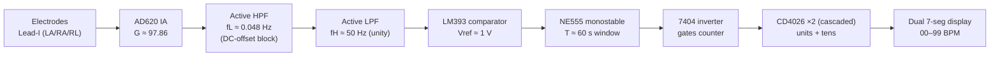

# Analog ECG Heart-Rate Monitor — No Microcontroller, No Firmware

A single-lead ECG signal-conditioning chain and heart-rate (BPM) counter built entirely from
analog and discrete-logic ICs. The signal is amplified and band-limited by an **AD620
instrumentation-amplifier IC** and two active filter stages, R-peaks are turned into a pulse
train by a comparator, and the beats are counted over a gated 60-second window and shown on a
two-digit seven-segment display. There is no microcontroller and no code anywhere in the system.

> Course project, B.Tech Electronics & Telecommunication, COEP Technological University (2025–26).
> Guide: Dr. Deeplaxmi V. Niture.

---

## What this project is (and is not)

- **Is:** a working demonstration of the full biomedical front-end pipeline — high-CMRR
  differential amplification, band-pass filtering, threshold-based feature detection, and
  time-gated digital counting — done with the cheapest, most widely available parts.
- **Is not:** a clinical instrument, and **not** a design I validated on a live human ECG.
  Every stage was characterised with a **function generator** emulating a biopotential, on a
  Rigol MSO5204 oscilloscope. Live-ECG operation is designed for but untested (see
  [Testing scope & limitations](#testing-scope--limitations)).

---

## Signal chain



Full-resolution schematics: [`schematics/analog-front-end.jpg`](schematics/analog-front-end.jpg)
and [`schematics/digital-subsystem.jpg`](schematics/digital-subsystem.jpg).

---

## Design at a glance

| Stage | Part | Key values | Purpose |
|---|---|---|---|
| Differential amp | AD620 (IA IC) | R_g = 510 Ω → G ≈ 97.86 | Lift ~1 mV ECG, reject 50 Hz common-mode |
| High-pass filter | 741 buffer | C = 10 µF, R = 330 kΩ → f_L ≈ 0.048 Hz | Block ±300 mV electrode DC offset |
| Low-pass filter | 741 | C = 10 nF, R = 318 kΩ → f_H ≈ 50 Hz | Reject EMG/EMI/mains |
| Comparator | LM393 | V_ref ≈ 1.00 V (40 k / 10 k) | R-peak → TTL pulse |
| Timing window | NE555 monostable | R = 545 kΩ, C = 100 µF → T ≈ 60 s | Define the 1-minute count window |
| Gate | 7404 | — | Invert 555 output to drive CD4026 INH |
| Counter + display | CD4026 ×2 | CO(units) → CLK(tens) | Count and decode to two 7-seg digits |

System gain comes from the **AD620 alone (×98)**; both active filter stages buffer at unity. On
the bench this lifts the function-generator test signal (~20 mV) above the 1 V comparator
reference. A **real 1 mV ECG at ×98 reaches only ~0.1 V — below the reference** — so live
operation needs extra gain (the ×21 stage drawn in the Proteus schematic, which would bring it to
~2 V) or a lower reference. That extra gain is a design-stage addition and was **not
hardware-validated**. Full derivations: [design-calculations.md](docs/design-calculations.md).

---

## Measured results (function-generator input, 10 Hz)

| Node | Measured V_pp | Figure |
|---|---|---|
| AD620 output | 1.899 V @ 9.997 Hz | [waveforms/1-ad620-output.jpg](waveforms/1-ad620-output.jpg) |
| HPF output | 1.859 V @ 9.985 Hz | [waveforms/2-hpf-output.jpg](waveforms/2-hpf-output.jpg) |
| LPF output | 1.798 V @ 10.00 Hz | [waveforms/3-lpf-output.jpg](waveforms/3-lpf-output.jpg) |
| Comparator output | 5.36 V (TTL) @ 9.998 Hz | [waveforms/4-comparator-output.jpg](waveforms/4-comparator-output.jpg) |

Stage-by-stage discussion, including how these numbers reconcile with the ×21 gain stage, is in
[results.md](docs/results.md).

---

## Repository map

```
analog-ecg-heart-rate-monitor/
├── README.md                     ← you are here
├── docs/
│   ├── design-calculations.md    ← gain, cutoffs, R/C selection, assumptions
│   ├── component-selection.md    ← why each part (the interview defense)
│   ├── results.md                ← waveform-by-waveform walkthrough
│   ├── project-report.pdf        ← full academic report
│   ├── handwritten-analog-calcs.jpg
│   └── handwritten-digital-calcs.jpg
├── schematics/                   ← Proteus schematics (analog + digital)
├── waveforms/                    ← Rigol MSO5204 CRO captures
├── hardware/                     ← breadboard photos
└── bom/bill-of-materials.md
```

---

## Testing scope & limitations

Being explicit, because this matters for anyone reading the results:

1. **No live-ECG test.** All measurements used a function generator emulating a biopotential
   (10 Hz sine, ~19.5 mV differential). A real 1 mV ECG from skin electrodes was never acquired.
2. **All gain is in the AD620 (×98); the chain is unity after it.** The measured stages read
   AD620 1.899 V → HPF 1.859 V → LPF 1.798 V, i.e. the filters buffer at unity — the ×21 stage in
   the Proteus schematic was not effective in the measured hardware. So the demonstrated operation
   relied on a function-generator input (~20 mV) larger than a real ECG. Detecting a real 1 mV ECG
   against the 1 V reference needs the extra gain or a lower threshold (untested). See
   [results.md](docs/results.md).
3. **50 Hz rejection is a filter roll-off, not a notch.** The LPF is only −3 dB at 50 Hz, so
   mains hum is attenuated, not eliminated. A Twin-T notch or a PCB ground plane would be needed
   for a quiet real-world trace.
4. **No patient isolation.** Not safe for connection to a person off mains-derived rails.

See [design-calculations.md → Future work](docs/design-calculations.md#future-work) for the path
to a live-ECG-capable version.

---

## How to reproduce

1. Build the analog front-end (`schematics/analog-front-end.jpg`) on one breadboard and the
   digital counter (`schematics/digital-subsystem.jpg`) on another; share a single star ground.
2. Power: ±5 V for the AD620/741s, +5 V for the digital section. Decouple every IC with 0.1 µF.
3. Inject a low-mV, ~1 Hz sine (≈60 "BPM") at the AD620 input, or connect Lead-I electrodes.
4. Press **RESET** (display → 00), then **TRIGGER** (555 opens the 60 s window). Read BPM when
   the count freezes.

Full bring-up and troubleshooting steps are in the report (Appendix C).

## References

W. Y. Du and W. Jose, "Design of an ECG sensor circuitry for cardiovascular disease diagnosis,"
*Int. J. Biosensors & Bioelectronics*, vol. 2, no. 4, pp. 120–125, 2017 — the reference design
this project simplifies. Datasheets for all ICs are listed in [bom/bill-of-materials.md](bom/bill-of-materials.md).
