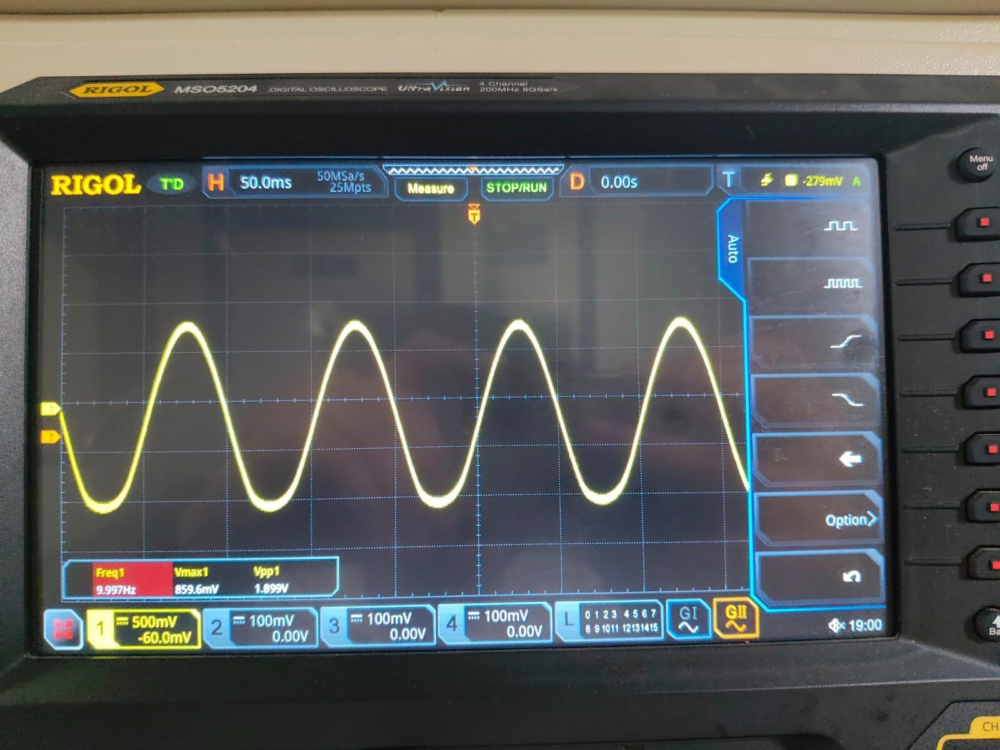
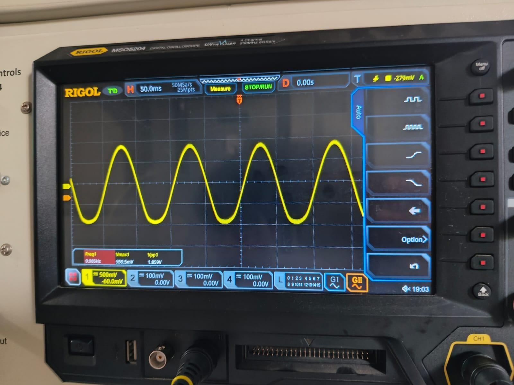
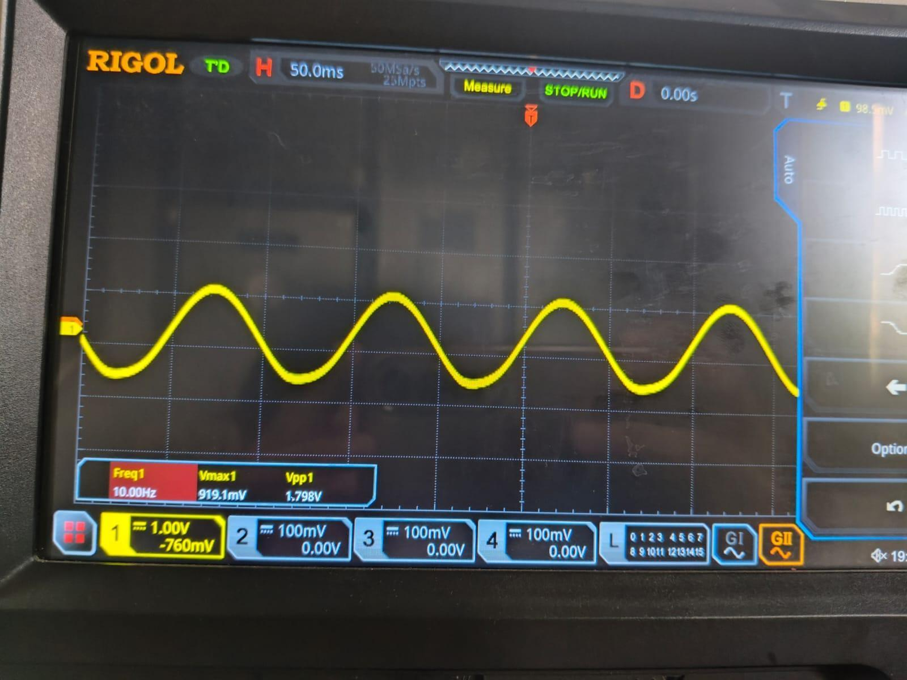
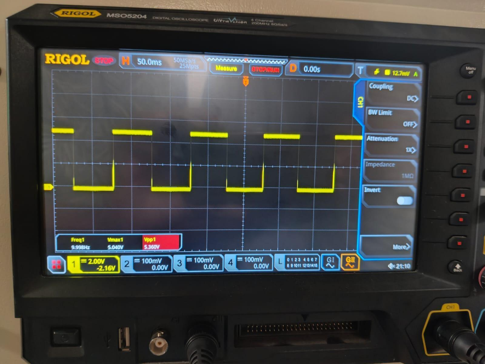

# Results & Waveform Walkthrough

All captures are from a **Rigol MSO5204** (200 MHz, 8 GSa/s). The input was a **function
generator**, not a live ECG (see [limitations](../README.md#testing-scope--limitations)). Test
signal: a 10 Hz sine, chosen because it sits well inside the 0.048–50 Hz passband, so each stage
can be characterised with almost no filter attenuation.

> **Gain note (read before the numbers).** The measured chain reads AD620 = 1.899 V →
> HPF = 1.859 V → LPF = 1.798 V — the signal gets slightly *smaller* through the filters, so all
> system gain (≈×98) sits in the AD620 and the filter stages are unity buffers. The ×21 stage in
> the Proteus schematic was not effective in the measured hardware (with it in-path, a 19.5 mV
> input would drive the LPF output to ~40 V and clip the ±5 V rail). Consequence: the ×98 chain
> only clears the 1 V comparator reference because the **test input was ~20 mV — far larger than a
> real ~1 mV ECG**. A real ECG would need the ×21 (→ ~2 V) or a lower reference; that path is
> designed but not validated here.

---

## 1. AD620 instrumentation-amplifier output



Clean sinusoid, **V_pp = 1.899 V at 9.997 Hz**, centred on a ~60 mV DC offset. From the applied
differential input of ≈19.5 mV_pp, the measured ratio is 1.899 / 0.0195 ≈ **97.4**, against the
design gain of 97.86 — a deviation under 0.5 %. The AD620 gain is confirmed.

## 2. High-pass filter output



**V_pp = 1.859 V at 9.985 Hz** — essentially unchanged from the AD620 output, exactly as expected
for a 10 Hz signal sitting more than two decades above the 0.048 Hz corner. The HPF's real job —
blocking DC — was verified separately: injecting a deliberate 1 V DC offset at the input drifted
the AD620 output but left the HPF output centred at zero (within the op-amp's few-mV bias error),
confirming the AC-coupling action of the 10 µF series cap.

## 3. Low-pass filter output



**V_pp = 1.798 V at 10.00 Hz.** A first-order LPF with a 50 Hz corner should attenuate a 10 Hz
signal by:

```
|H| = 1 / √(1 + (10/50)²) = 1 / √1.04 ≈ 0.980  →  ≈ −0.18 dB
```

The measured ratio 1.798 / 1.859 ≈ 0.967 (≈−0.29 dB) is within tolerance of that prediction. The
same filter checked at 100 Hz and 200 Hz gave roughly −6 dB and −12 dB — the expected 20 dB/decade
first-order slope.

## 4. Comparator output



A clean square wave, **V_max = 5.04 V, V_pp = 5.36 V at 9.998 Hz** (the slight overshoot above
5 V is the open-collector pull-up edge). Each positive edge is sharp enough to clock a CD4026
reliably. On this sine test the duty cycle is ~50 %; with a real ECG each pulse would be only a
few milliseconds wide (the QRS duration), so the duty cycle would be very small — but the counter
only cares about the rising edge, so this is irrelevant to the count.

---

## Counter & display behaviour

- Press **RESET** → display reads `00`.
- Press **TRIGGER** → the 555 opens the 60 s window, the 7404 pulls INH low, and the display
  increments on every positive comparator edge.
- **At 10 Hz for 60 s** the counter sees ~600 pulses. Because two cascaded CD4026s roll over
  99 → 00, the display **wraps** (600 mod 100 = 0) rather than freezing — this test was only to
  confirm counting and rollover, not a BPM reading.
- **At 1 Hz for 60 s** (emulating 60 BPM) the display reads **60** at window close — the intended
  result.
- After 60 s the 555 goes low, INH goes high, and the display **freezes** at the final count until
  the next RESET.

> Correction vs. the report: §7.6 states the display "reaches 99 and then halts" at 10 Hz. With
> two cascaded decade counters and no freeze logic, it rolls over to 00. The freeze happens only
> *after the 60 s window closes*, at whatever value the count then holds.

---

## Design vs. simulation vs. measured

| Stage | Design | Proteus | Measured |
|---|---|---|---|
| AD620 V_pp (10 Hz) | 1.957 V | 1.95 V | 1.899 V |
| AD620 frequency | 10.000 Hz | 10.00 Hz | 9.997 Hz |
| HPF V_pp (10 Hz) | ~1.96 V (~0 dB) | 1.92 V | 1.859 V |
| LPF V_pp (10 Hz) | ~1.92 V (−0.18 dB) | 1.86 V | 1.798 V |
| LPF corner | 50.05 Hz | 49.8 Hz | 48–52 Hz (R tol.) |
| Comparator V_pp | 5.00 V | 5.0 V | 5.36 V |
| 555 window | 60.00 s | 60.0 s | 60.0 ± 0.5 s |

All checkpoints agree within ~5 %.

## Sources of error

- **Resistor ±5 % / capacitor ±10–20 %** — explains the spread in cutoff frequency.
- **741 offset (±2 mV) and bias current** through the large filter resistors — small DC error at
  the LPF output; not enough to affect comparator switching.
- **Ambient 50 Hz pickup** on long generator leads — reduced from ~30 mV to <5 mV by twisting and
  shortening the input pair.
- **Probe/cable capacitance** interacting with the 318 kΩ LPF source impedance — minimised with a
  10× probe.
- **Electrolytic leakage** on the 555 timing cap — drifts the window slightly with temperature;
  compensated by trimming R.

Across five consecutive trials on the same input, the final count was repeatable to within
±1 count, and the analog front-end showed no oscillation across the passband.
